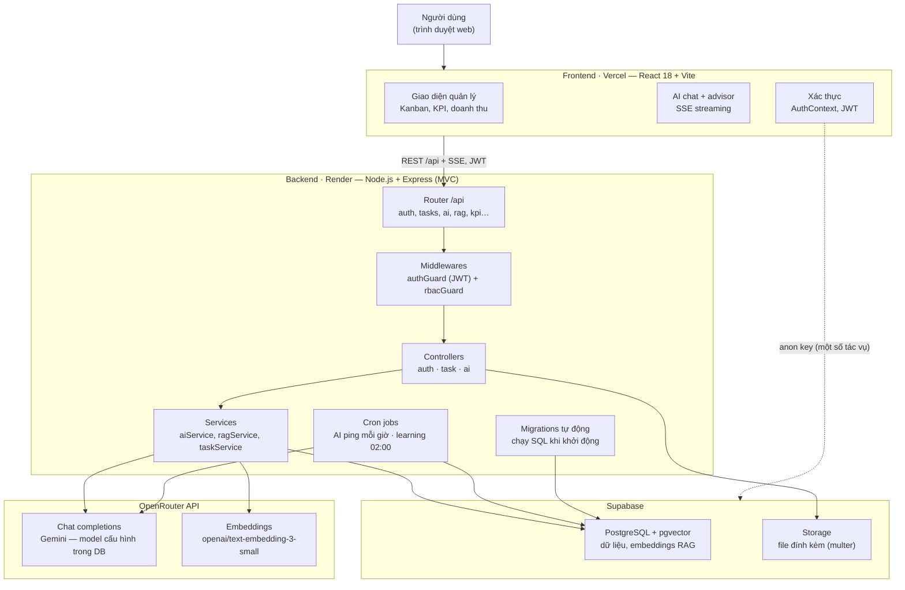

# Kiến trúc hệ thống — TaskFlow (hub-dubai)

> File này mô tả kiến trúc tổng thể của ứng dụng để con người và AI agents nắm nhanh bối cảnh.
> Cập nhật file này khi thay đổi cấu trúc lớn (thêm tầng, đổi hosting, thêm service ngoài).

## Sơ đồ tổng quan

## Các tầng chính

### 1. Frontend — `frontend/` (deploy: Vercel)
- **Stack**: React 18 + Vite, axios, react-markdown, supabase-js.
- **API base**: `frontend/src/api/apiBase.js` và `axiosClient.js` — ưu tiên `VITE_API_URL`, fallback `https://taskflow-ai-dashboard.onrender.com`.
- **Xác thực**: `frontend/src/contexts/AuthContext.jsx` — JWT lưu phía client, gắn vào header mỗi request.
- **AI streaming**: `frontend/src/hooks/useAIChatStream.ts` và `useAIStream.js` — nhận SSE từ `/api/ai/chat`.
- **Supabase trực tiếp**: `frontend/src/utils/supabaseClient.js` dùng anon key cho một số tác vụ.
- **Components chính**: `GlobalKanban`, `FacilityDashboard`, `AIAdvisor`, `AIChatBox`, `RevenueOverviewDashboard`, `HeatmapKPI`, `KPISettings`, `RAGManagerPanel`, `AdminConfigPanel`, `AIInsightsManager`, `DailyCheckin`…
- **SPA routing**: `vercel.json` rewrite toàn bộ về `index.html`.

### 2. Backend — `backend/` (deploy: Render)
- **Stack**: Node.js + Express 4, mô hình MVC trong `backend/src/`.
- **Entry**: `backend/server.js` — khi khởi động: (1) tự chạy migrations SQL trong `backend/migrations/`, (2) nạp cron jobs, (3) mount router tổng `/api`.
- **Routes** (`backend/src/routes/index.js`): 14 nhóm — `/auth`, `/tasks`, `/ai`, `/facilities`, `/kpi`, `/logs`, `/reports`, `/checkin`, `/ai-ping`, `/config`, `/users`, `/rag`, `/internal`, `/upload`.
- **Middlewares**: `authGuard.js` (xác thực JWT), `rbacGuard.js` (phân quyền theo vai trò).
- **Controllers**: `authController.js`, `taskController.js`, `aiController.js`.
- **Services**: `aiService.js`, `ragService.js`, `taskService.js`.
- **Cron jobs** (`backend/src/cron/`):
  - `aiPingJob.js` — chạy mỗi giờ (`0 * * * *`).
  - `aiLearningJob.js` — chạy 02:00 hằng ngày (`0 2 * * *`), "trí nhớ dài hạn": trích xuất bài học vào bảng `ai_learned_insights`.

### 3. Dữ liệu — Supabase
- **PostgreSQL**: kết nối qua `pg` Pool (`backend/src/config/database.js`, dùng `DATABASE_URL`).
- **pgvector**: lưu embeddings, tìm kiếm tương đồng cho RAG trong `ragService.js` (toán tử `<=>`, ngưỡng similarity > 0.3 chống hallucination).
- **Storage**: bucket `attachments` — upload qua `/api/upload/attachment` (multer memory → `supabaseAdmin.js` với service role key).
- **Bảng cấu hình**: `system_config` chứa API key + model AI (cache 5 phút trong `aiController.js`).

### 4. AI — OpenRouter
- **Chat completions**: `https://openrouter.ai/api/v1/chat/completions` — model Gemini (vd. `google/gemini-2.5-flash`), cấu hình động trong DB, có thể đổi qua Admin panel.
- **Embeddings**: `https://openrouter.ai/api/v1/embeddings` — model `openai/text-embedding-3-small`, phục vụ RAG.

## Luồng request điển hình

1. **CRUD task**: Frontend → `axiosClient` (JWT) → `/api/tasks` → `authGuard` → `rbacGuard` → `taskController` → `taskService` → PostgreSQL.
2. **AI chat (RAG)**: Frontend → `/api/ai/chat` → `aiController` → `ragService` tạo embedding câu hỏi (OpenRouter) → tìm vector tương đồng (pgvector) → ghép context → gọi chat completions (OpenRouter) → stream SSE về client.
3. **Upload file**: Frontend → `/api/upload/attachment` (multipart) → multer → Supabase Storage → trả public URL.
4. **Học tự động**: `aiLearningJob` (02:00) đọc dữ liệu hoạt động → gọi LLM trích xuất insights → lưu `ai_learned_insights` → hiển thị trong `AIInsightsManager`.

## Biến môi trường quan trọng

| Biến | Nơi dùng | Ý nghĩa |
|---|---|---|
| `DATABASE_URL` | backend | Connection string PostgreSQL (Supabase) |
| `SUPABASE_URL`, `SUPABASE_SERVICE_ROLE_KEY` | backend | Storage admin |
| `DEFAULT_AI_MODEL` | backend | Model AI fallback |
| `PORT` | backend | Mặc định 5000 |
| `VITE_API_URL` | frontend | URL backend |
| `VITE_SUPABASE_URL`, `VITE_SUPABASE_ANON_KEY` | frontend | Supabase client phía trình duyệt |

## Ghi chú cho agents

- Code backend "chuẩn" nằm trong `backend/src/` — các file `fix*.js`, `patch_*.py/js`, `test_*.js`, `old_server.js` ở thư mục gốc và `backend/` là file tạm/thử nghiệm, **không phải** source chính.
- `backend/server.js` là entry point hiện hành; `backend/old_server.js` và `server.js.backup` là bản cũ.
- Migrations chạy tự động khi server khởi động (idempotent nhờ `IF NOT EXISTS`) — thêm migration mới phải đăng ký tên file vào mảng `migrationFiles` trong `server.js`.
